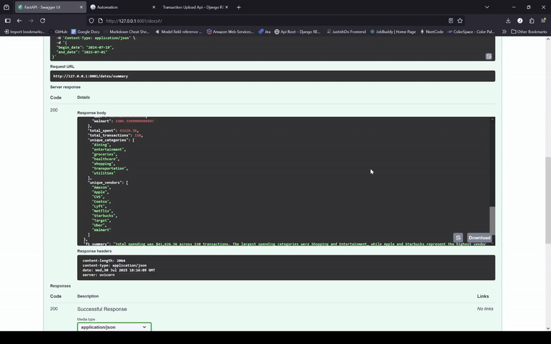
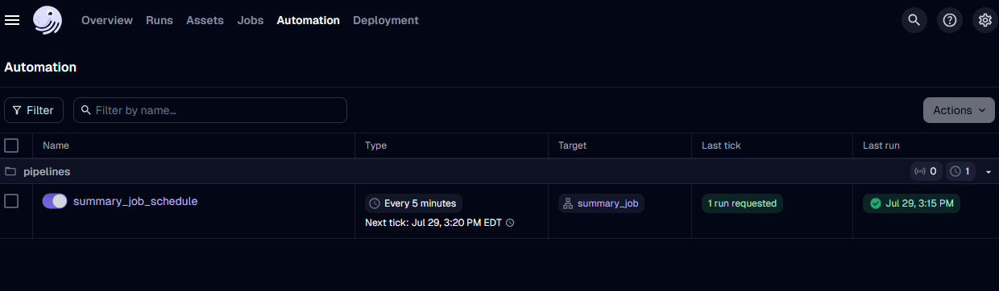

# Spending Analysis ETL

## Primary Function 

Microservice to **extract** data from our Django Restapi, **transform** our data (maybe include Vertex AI for more insightful data) and **load** into *Snowflake*.

**Snowflake Dagster Data Pipeline ETL Demo:**
 


## Development 

**07/18/25**
- Building an **extractor** to **ingest** data from our Django RestAPI
  - Two functions to Grab all the files + Find all the summary for it 
- **transformer** to **add/change** information based on our extractor 

**07/21/25** 
- Added more key fields for extra data:
  - Averaging Category & Vendor 
  - Percent Change over Time for Category & Vendor 
- Vertex AI New SDK to generate a summary based on our financial data 
  - IAM -> **Service Accounts** 
  - IAM Polcy ->
    - **Vertex AI User**
    - **Vertex AI Admin**
  - Json key 
    - Service Account --> Service Name --> Keys --> Generate JSON
  - Vertex AI API - Enable 

 **07/22/25**
 - Plans
   - Connect with Snowflake Data Warehouse 
   - Build FastAPI Endpoint to grab Summaries
 - Treat Snowflake as a Database 
 - **FastAPI queries to see a summary report during that period**
 - Limitation: If we don't have same Categories...
   - `AssertionError: 8 columns passed, passed data had 7 columns`
 - 

Snowflake Worksheet:

```sql
CREATE TABLE file_details (
    id STRING PRIMARY KEY,
    begin_date DATE,
    end_date DATE, 
    details VARIANT,
    fi_summary STRING,
    created_at DATE DEFAULT CURRENT_DATE
)
```
1) We select the warehouse -> database -> schema  

**Inserting Variant** 

Inserting with Variant is different from your typical: IIV (Insert Into Values) we use IIS (Insert Into Select)

```py
insert_query = """
    INSERT INTO file_details (id, begin_date, end_date, details, fi_summary)
    SELECT
    %s,
    %s,
    %s,
    PARSE_JSON(%s),
    %s
"""

try:
    cursor.execute(insert_query, (
        id, 
        begin_date,
        end_date,
        json.dumps(details),
        fi_summary
    ))
    
    # Committing our insert 
    conn.commit()
    print("✅ Inserted file details successfully.")
except Exception as e:
    print('Error inserting into Snowflake')
    print(e)
```
1) Make sure we pass in `json.dumps()` with a `PARSE_JSON(%s)`
2) Always *commit your connection* if we're updating or inserting 

**How do we get Connection and Cursor?**

*loader.py*

```py
from snowflake.connector import connect 

# Connect Function
connect(
      user=os.getenv("SNOWFLAKE_USER"),
      password=os.getenv("SNOWFLAKE_PASSWORD"),
      account=os.getenv("SNOWFLAKE_ACCOUNT"),
      warehouse=os.getenv("SNOWFLAKE_WAREHOUSE"),
      database=os.getenv("SNOWFLAKE_DATABASE"),
      schema=os.getenv("SNOWFLAKE_SCHEMA")
  )
```
1) These are found within your account --> make sure you head over to **Admin** --> **Connect a tool to Snowflake**


**Current WorkFlow**
- **Extractor** finds all the file id and their summary 
- **Transform** provides additional information based on the combined summary
  - Total Transactions and Money Spent 
  - Average between Category and Vendors 
  - Percent Change between Category and Vendors 
- **Transforms** uses Vertex AI (New SDK with `from google import genai`) to provide a **Financial Summary** based on the details  
- **Loader** returns a *Snowflake Connection*  for our **Transformer** script 
- Function `check_report_exists()` runs a **query** with our connector to check for existing reports given **Begin and End Date**
  - If report **exists** we check for **transaction increases**. If the transaction increase that means more uploaded files trigerring an **update report function**
  - If report **doesnt exist** we create a new row by **inserting into Snowflake**
- Connection to Snowflake closes out

**Why Snowflake? Critical Limitation! Fast Api Relevance?**

*Snowflake* is important because it acts as a **data warehouse**. The **VARIANT** allows us to store *JSON*-like data type for our summaries.

Difference in **Categorical Shapes** could crash this program. 
- A file that doesn't include all the same exact Categories
- Additionally no **multi-company support**. This only works for one big **client**.

*FastAPI* will help us see the financial summaries generated by triggering our `transformer.py` 
- POST request to create summaries
- GET request to view summaries 

**Overall Objective**: **FastAPI queries to see a summary report during that period**


**07/28/25**
- Plan
  - FastAPI Implementation querying Snowflake for summary reports 
  - Dagster as orchestration tool 
- FastAPI Endpoint
  - Shows all the existing Date Ranges for gnerated summary and details throughout the periods 
  - Queries Snowflake for *details* + *financial summary* 
- Set Up Dagster Pipeline to launch 
- `pip install dagster dagster-webserver dagster-dg-cli`
- Dagster Process
  - 1) Set up Dagster Job [dagster_pipeline.py](pipelines/dagster_pipeline.py)
  - Make sure we have our script in pipelines directory 
  - Be sure its a **python directory** meaning we have `__init__.py` as well
  - Create a `pyproject.toml` because of error: `Error: No arguments given and no [tool.dagster] block in pyproject.toml found.`

*pyproject.toml*

```toml
[tool.dagster]
module_name = "pipelines"
```
1) We put `"pipelines"` because thats the python directory that holds our ops and jobs


**Exposing Jobs to Dagster** 

`pipelines/__init__.py`

```py
from dagster import Definitions 
from .dagster_pipeline import summary_job 

# Adding Job to Definitions 
# Then we could run dagster dev
defs = Definitions(jobs=[summary_job])

```

**Running up Dagster UI**

`dagster dev`

**07/29/25**
- Dagster Daemon to schedule my jobs (Found on the Deployment tab on dagster dev)
- Make a crontab scheduler similar to Django Celery 
- Add the scheduler to our definitions then toggle it in **Automation** tab 

```py
# pipelines/dagster_pipline.py
# Crontab scheduling 
summary_schedule = ScheduleDefinition(
    job=summary_job,
    cron_schedule="*/5 * * * *", # every 5 minutes 
    execution_timezone='US/Eastern',
    name='summary_job_schedule'
)

# pipelines/__init__.py
defs = Definitions(jobs=[summary_job], schedules=[summary_schedule])
```




**Future Notes**
1) Currently this only works with the same category + vendors
   1) Practice Pandas --> Rework the script for vectorization across dataframes
2) Dagster Pipeline is local can we push this to production?
   1) Containerize --> Push to VM q
3) How useful will thie API be to our React Frontend?
   1) We could showcase the Financial Summary on the front 
   2) Display the financial data across given time ranges 

**07/30/25**
1) Fixed Pandas Script for dynamic vendors & categories 
   1) Instead of appending data to an array which is all based on positioning and index
   2) We used a hashmap with vendor/category as key 
   3) Fillna our dataframes for better vectorization if row doesnt have that vendor/cateogry 

# Demo
 